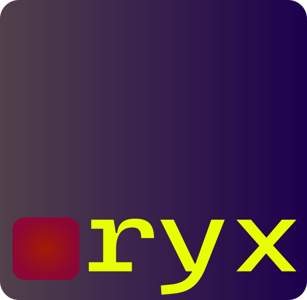

# Ryx
</img>
### A low-level programming language designed to produce ultra-minimal, high-performance binaries

Ryx is a programming language that operates just above the assembly level, providing developers with fine-grained control over system resources while retaining modern language features. Its primary objective is to generate the smallest possible binaries that run at maximum speed—ideal for performance-critical applications, embedded systems, and other scenarios where efficiency is paramount.

Key Characteristics:
- **Ultra-Minimal Binaries:** Ryx is engineered to produce binaries with minimal overhead, ensuring that every byte is optimized for performance.
- **High Performance:** By working close to the hardware, Ryx enables you to harness the full potential of your system's capabilities.
- **Low-Level Control:** Gain direct access to low-level operations and resources, similar to assembly programming, but with a more readable and maintainable syntax.
- **Modern Conveniences:** While it offers the precision of low-level programming, Ryx also includes features that streamline development and enhance code clarity.

Whether you're developing for highly constrained environments or pushing the boundaries of software performance, Ryx provides the tools and flexibility to achieve your goals.

---
> ## Ryx is under the Joay License Version 1.5 that can be found [here](LICENSE.md)